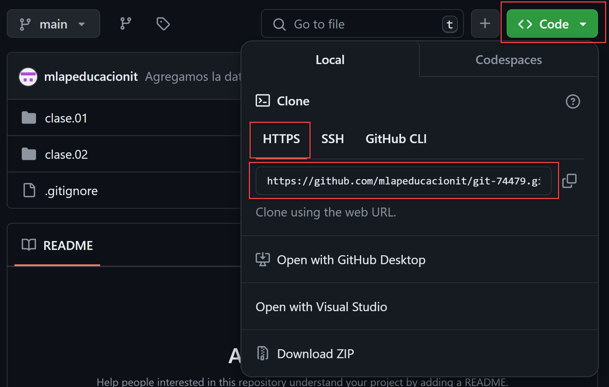
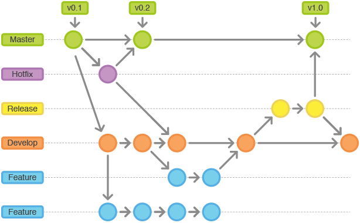

# Clase 02 - Git desarrollo colaborativo

## Archivo .gitignore
Existe un archivo que nos permite ignorar ciertos archivos que queremos que no sean parte de los commits. Se crea generalmente en el carpeta raiz del proyecto.

```sh
touch .gitignore
```

## Archivo .gitkeep
Existe un archivo que nos permite agregar a los commit, las carpetas vacias que git por defecto ignora.

```sh
touch .gitkeep
```

# Subir nuestro repositorio a la nube
No logueamos en GitHub y creamos un repositorio de GitHub. Dejo todo por defecto y si quiero cambio la visibilidad, publico todos pueden acceder y solo yo modifico. Privado. Nadie puede ver a menos que lo agregue al repositorio para que lo vea.

## Agregar la url del repositorio remoto al repo local

```sh
git remote add <alias> <url>
git remote add origin https://github.com/mlapeducacionit/git-74479.git
```

## Confirmar si tengo un remoto en el repositorio local

```sh
git remote
git remote -v # mas detalle -v:verbose
```

## Subir la copia completa o parcial de commits del local al remoto

```sh
git push -u <repositorio-remoto> <rama/branch>
git push -u origin main # -u -> sincronizar la rama local con la remota. Solo la primera vez se agrega el flag/bandera -u
```

## Recuperar el repositorio local despues de una catastrofe
Si tengo una copia del repositorio en el remoto puedo recuperar la informacion en el local.



```sh
git clone <url> # me crea una carpeta con el nombre del repositorio en el directorio actual
git clone <url> ./ # copia el repositorio en el carpeta actual
git clone https://github.com/mlapeducacionit/git-74479.git .
```

## Traigo la metada del remoto al local

```sh
git fetch # Solo trae la metadata del repositorio remoto al local
```

## Actualizo el local con la info del remoto

```sh
git pull # Me trae los archivos actualizados, los nuevos commits que no existen en el local
```

**Nota**: Cuando hago pull, estoy haciendo un fetch+pull

# RAMAS (Branches)
Estructura auxiliar que nos permite trabajar sin ensuciar lo hecho hasta el momento.



## Listar ramas

```sh
git branch
```

## Crear una rama

```sh
git branch <nombre>
git branch feature/ramas
```

## Cambiarse de rama

```sh
git switch <nombre>
git switch feature/ramas
git switch - # Toggle a la anterior
git switch -c feature/demo # crea la rama y me mueve a esa rama
```

## Borrar un rama

```sh
git branch -d <nombre-rama-a-borrar>
git branch -d feature/demo # En el caso de que los cambios/commits no esten en ningun otro lado del repositorio no me va a dejar borrarla, me va a pedir confirmacion
git branch -D feature/demo # Confirmacion de borrado. Borrado forzado
```


