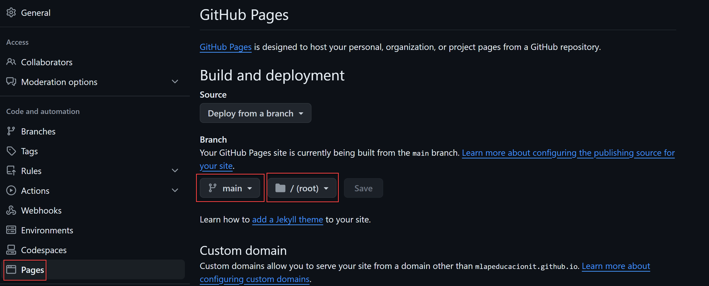

# Clase 04 - Git Desarrollo Colaborativo

# Git Pages
Me permite alojar un sitio. Sitios Estaticos. JavaScript, html, css. React, Vue, Angular. Hosting gratuito.

Tengo que crear un repositorio especial. 

<nombre-cuenta-github>.github.io

Y si ya tengo ocupado. Puedo a partir de cualquier repositorio hacer un GitPages.

Settings > Pages



## PDF con comandos (Machete)

<https://training.github.com/downloads/github-git-cheat-sheet.pdf>
<https://www.atlassian.com/git/tutorials/atlassian-git-cheatsheet>

## Cherry Pick
Permite seleccionar un commit  o varios de manera independiente y colocarlos en otra rama.

### Selecioando un unico commit

```sh
git cherry-pick <hash>
```

Si hay conflicto, solucionarlo y hacer los siguientes comandos

```sh
git add .
```

```sh
git cherry-pick --continue
```

### Seleciono varios commit con extremos

```sh
git cherry-pick <hash>^..<hash>
```

### Seleciono varios commit sin extremos

```sh
git cherry-pick <hash>..<hash>
```

# Git tags

## Creando un tag

```sh
git tag -a v2.0 -m "La version 2.0 de la aplicacion" # Si no le coloco hash me crea la etiqueta en el ultimo commit de la rama en la que estoy
git tag -a v0.1 <hash> -m "La primera version de nuestra aplicacion"
git tag -a v1.0 cc350e8 -m "Primera version oficial del proyecto"
```

## Ver detalle del tag

```sh
git show v2.0
```

## Listar tags

```sh
git tag -l
```

## Borrar tags

```sh
git tag -d <nombre-tag>
```

## Subir tag

```sh
git push origin v1.0
```